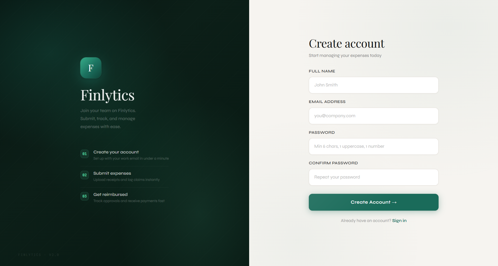
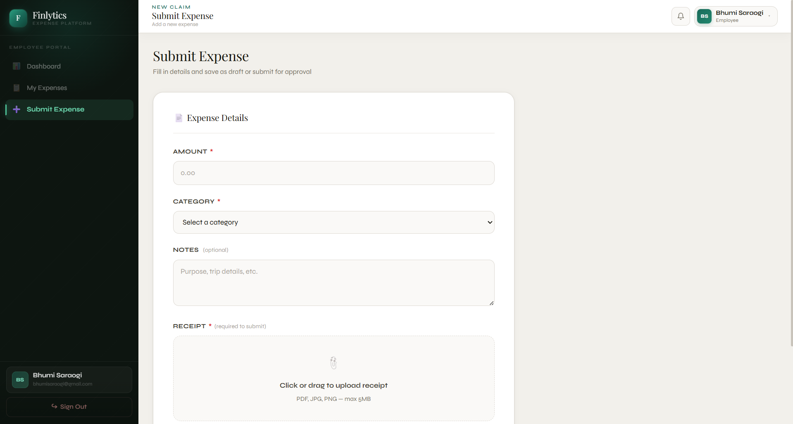
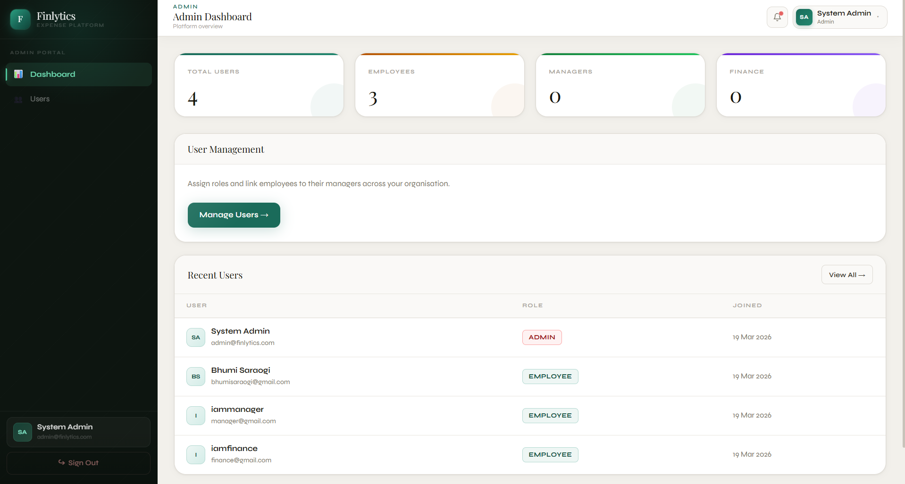
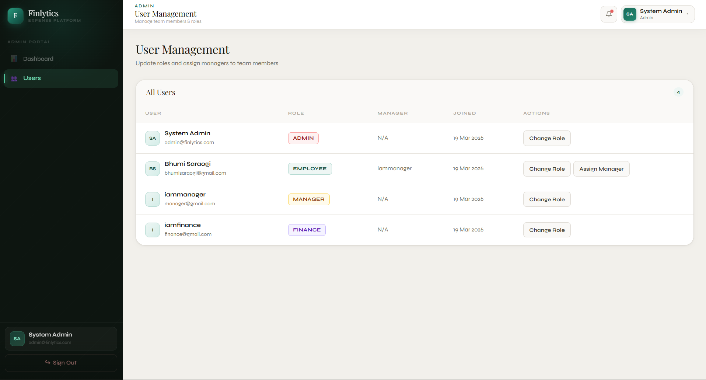

# Finlytics | Expense Approval & Reimbursement System

Finlytics is a role-based expense management system designed to streamline how organizations track, approve, and manage employee expenses.
The platform follows a structured approval workflow where employees submit expenses, managers review them, and the finance team processes the final payment. This ensures transparency, accountability, and efficient financial tracking.

---

### Project Purpose
Finlytics demonstrates how a real-world financial workflow system works inside organizations using role-based access control and multi-level approval processes. The project simulates how companies manage expense reimbursements through a secure and structured system.

---

### Features
Role-Based Authentication: Users are assigned roles by the Admin, which determines system permissions.

Roles include:

- Admin

Create and manage users

Assign roles to employees

Assign managers to employees

- Employee

Create new expense requests

Submit expense details for approval

Track expense status

- Manager

Review submitted employee expenses

Approve or reject requests

- Finance Team

Review manager-approved expenses

Mark expenses as Paid

Reject expenses if necessary

---

## Future Enhancements

- Expense analytics dashboard
- Budget prediction & spending insights
- Expense category tracking
- Report generation
- Email notifications for approvals

---

## Screenshots

  
  

  
  

